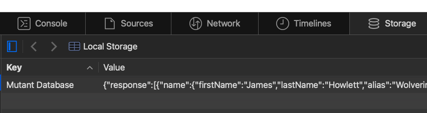

# MUTANT DATABASE

## Overview
This multi-step project involves using `localStorage` to manipulate and display data. It loads data from `localStorage`, parses it, and then allows the user to interact with the data through search and display functions.

### Web Inspector
To view the data stored in `localStorage`, open the browser's Web Inspector:

- **Chrome**: Right-click > Inspect > Go to the **Application** tab > **Local Storage**.
- **Safari**: Right-click > Inspect Element > Go to the **Storage** tab > **Local Storage**.

Here, you’ll find the prefilled test data stored under the key `mutantDatabase`.

---

## Description

The goal of this project is to load data from `localStorage`, parse it, and display it on the webpage. You'll be provided with a `Database` object that contains methods for loading and searching data.

### Database Object Structure

- **Key Name**: The `key` used in `localStorage` to retrieve data (provided).
- **Data**: The `data` property stores the parsed object data loaded from `localStorage`.

### Functions

#### 1. `loadDataSource()`
- **Purpose**: Load and parse the data from `localStorage`.
- **Process**:
  - Retrieves data from `localStorage` using the predefined key.
  - Converts the data from a JSON string to a JavaScript object.
  - Saves the parsed object to the `data` property of the `Database` object.

#### 2. `searchForMutantByAlias(mutantAlias)`
- **Purpose**: Search for a mutant by their alias.
- **Process**:
  - Takes a mutant alias as a parameter.
  - Searches through the `data` array in the `Database` object.
  - Finds the mutant's object by matching the `alias` property.
  - Sets the `index` variable to the object's index in the array. If not found, the index remains `-1`.

#### 3. `displayData(index)`
- **Purpose**: Display the data for the mutant at the specified index.
- **Process**:
  - Takes the `index` of the mutant object as a parameter.
  - Displays the mutant's data on the webpage using HTML templates (either the provided or custom templates).

## Requirements

### JavaScript

For the project, the following JavaScript functions and concepts:

- **DOM Manipulation**:
  - `document.querySelector(target)`
    - `.insertAdjacentHTML(position, value)`
    - `.innerHTML`
    - `.innerText`
  
- **JSON**:
  - `.parse(value)` to convert string data into an object.
  
- **localStorage**:
  - `.getItem(key)` to retrieve stored data.

- **Objects**:
  - Accessing object properties using `object.key`.

- **Loops & Iterators**: loops to iterate through the data
  - `for()`
  - `.forEach()`, **or** 
  - `for...in`

### HTML

- You can use the provided template or create your own layout.
- Ensure all relevant fields of the mutant data are displayed clearly.

### CSS

- Apply styles such as width, height, margin, padding, and font to enhance the page's appearance.
- Be creative with the layout!

## Tips

- **Be creative** with the design and user interface. Think about how to display the data in a user-friendly way.
- **Test the code frequently** to ensure all functionalities work as expected (loading, searching, and displaying data).

## Advanced

For an additional challenge, you can integrate **IndexedDB** to store and retrieve the mutant data. This can provide more flexibility and advanced storage capabilities compared to `localStorage`.

- **IndexedDB API**: Use IndexedDB to store, retrieve, and display the data.
- Modify your functions to interact with IndexedDB rather than `localStorage`.